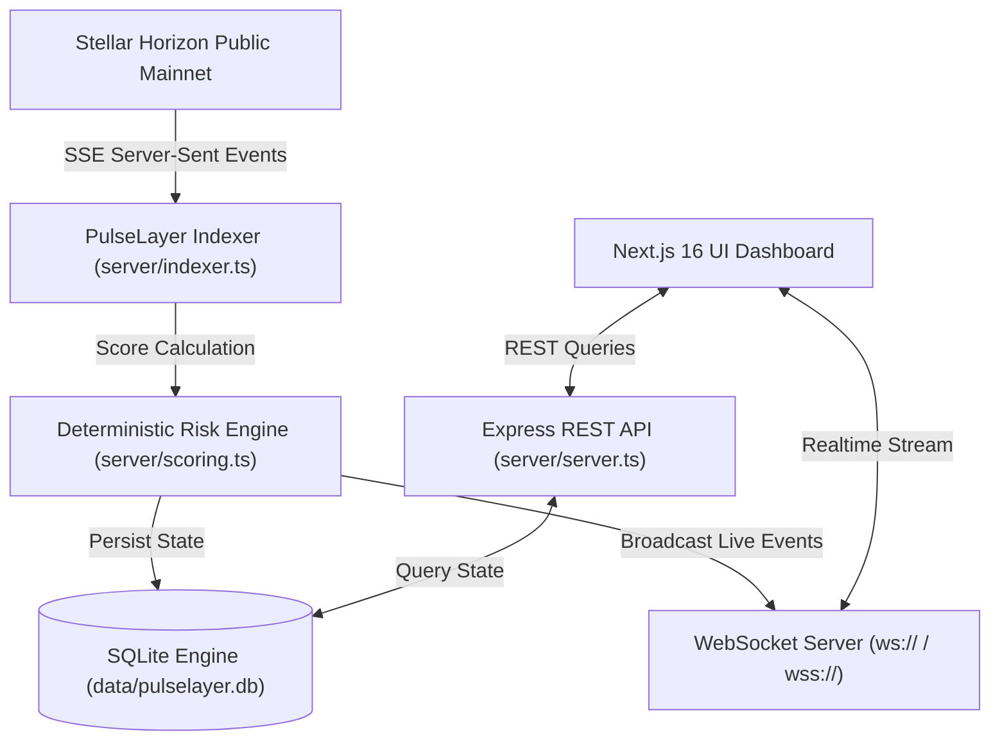

# PulseLayer ⚡

**Real-Time Deterministic Trust Signal Indexer & Risk Analytics Protocol for the Stellar Network**

[](https://stellar.org)
[](https://nextjs.org)
[](https://react.dev)
[](https://www.typescriptlang.org)
[](https://expressjs.com)
[](https://github.com/WiseLibs/better-sqlite3)
[](LICENSE)

---

## Executive Overview

**PulseLayer** is an open-source, high-throughput behavioral analytics indexer and trust signal engine built for the Stellar ecosystem. It connects directly to Stellar Horizon nodes to stream, evaluate, and index account operational patterns in real time.

PulseLayer computes a dynamic, deterministic **Pulse Score (0–100)** for any Stellar public key (`G...`), translating historical lifespan, transaction velocity, counterparty exposure, balance liquidity, and trustline activity into actionable risk intelligence for wallets, institutional gateways, and automated decentralized protocols.

---

## Key Features

* **⚡ Live Horizon SSE Streaming**: Continuous ingestion of live Stellar mainnet ledgers and transactions with zero polling overhead.
* **🛡️ Deterministic Pulse Score Engine**: Multi-factor scoring mathematical model evaluating account lifespan, transaction consistency, liquidity depth, asset trustlines, and anomaly detection.
* **📡 Real-time WebSocket Protocol (`wss://`)**: Sub-second event broadcasting to frontend subscribers for instant transaction visibility.
* **🔍 Deep Factor Audits**: Detailed metric breakdown per account, complete with negative/positive signal triggers, history snapshots, and structured JSON audit export.
* **🌗 Adaptive Light & Dark Theme Engine**: High-contrast, accessibility-compliant user interface designed for both low-light operations centers and standard light environments.
* **☁️ Multi-Cloud Deployment Ready**: Pre-configured for seamless containerized deployment on **Render**, **Railway**, **Vercel**, or **Docker Compose**.

---

## System Architecture



For full system architecture specifications, read [ARCHITECTURE.md](ARCHITECTURE.md).

---

## Deterministic Scoring Mathematical Model

PulseLayer computes an account trust score \( S \in [0, 100] \) based on five core operational factors:

\[
S = \text{clamp}\Big( \sum_{i=1}^{5} w_i \cdot F_i - \Delta_{\text{anomaly}}, \, 0, \, 100 \Big)
\]

Where:
* **\( F_1 \) (Account Lifespan)**: Multi-stage logarithmic growth scaling with account age in days.
* **\( F_2 \) (Transaction Velocity & Consistency)**: Operational volume and active daily engagement ratio.
* **\( F_3 \) (XLM Liquidity Buffer)**: Reserve balance depth ensuring operational sustainability.
* **\( F_4 \) (Asset Trustlines)**: Diversity of anchor asset connections on Stellar.
* **\( F_5 \) (Success & Counterparty Ratio)**: Ratio of successful operations versus failed sequences.
* **\( \Delta_{\text{anomaly}} \)**: Dynamic penalty deduction applied when rapid volume spikes or suspicious burst patterns are detected.

---

## Technology Stack

* **Frontend**: Next.js 16 (App Router, Turbopack), React 19, TypeScript, Tailwind CSS v4, Lucide Icons, Recharts.
* **Backend Runtime**: Node.js, Express 5, WebSockets (`ws`), `better-sqlite3`.
* **Blockchain Layer**: Stellar SDK (`@stellar/stellar-sdk`), Horizon Mainnet SSE Stream.
* **Deployment**: Docker, Docker Compose, Render Blueprint, Railway, Vercel.

---

## Quick Start (Local Development)

### Prerequisites
* Node.js v20+ 
* npm v10+

### Installation & Setup

1. **Clone the repository**:
   ```bash
   git clone https://github.com/Justice989810/Pulse-Layer.git
   cd pulse-layer
   ```

2. **Install dependencies**:
   ```bash
   npm install
   ```

3. **Start the local development environment** (runs Express server + Next.js UI concurrently):
   ```bash
   npm run dev
   ```

4. **Access the application**:
   * **Web Dashboard**: `http://localhost:3000`
   * **Express REST API**: `http://localhost:5001/api/stats`
   * **WebSocket Stream**: `ws://localhost:5001/ws`

---

## Deployment Guide

PulseLayer is configured for instant cloud deployment. Read the comprehensive **[DEPLOYMENT.md](DEPLOYMENT.md)** guide for step-by-step instructions on deploying to:

* 🟢 **[Render Blueprint Setup](DEPLOYMENT.md#option-1-deploy-everything-on-render-recommended-blueprint)** (`render.yaml`)
* 🚂 **[Railway One-Click Deployment](DEPLOYMENT.md#option-2-deploy-everything-on-railway)** (`railway.json` & `Procfile`)
* ⚡ **[Hybrid Vercel + Cloud Backend](DEPLOYMENT.md#option-3-hybrid-deployment-vercel--render--railway)**
* 🐳 **[Docker & Docker Compose](DEPLOYMENT.md#option-4-local-or-vps-docker-deployment)** (`docker-compose up -d`)

---

## API Reference Summary

### REST Endpoints

| Method | Endpoint | Description |
|---|---|---|
| `GET` | `/api/stats` | Global network indexer stats, ledger height, and average trust score |
| `GET` | `/api/score/:account` | Detailed Pulse Score, factors, and active signals for Stellar address |
| `GET` | `/api/history/:account` | Historical score snapshot timeline for charts |
| `GET` | `/api/top` | Paginated directory of indexed Stellar accounts with risk filtering |
| `GET` | `/api/feed` | Recent indexed Stellar operations feed |
| `GET` | `/api/export/:account` | Download full structured JSON audit payload for an account |

JSON request bodies are limited to 100 KB; larger requests are rejected with HTTP 413.

### WebSocket API
* **Endpoint**: `/ws`
* **Event Payload**:
  ```json
  {
    "type": "LIVE_TRANSACTION",
    "data": {
      "id": "tx_981249",
      "account_id": "GAK6E46MRRAG72MNDHNE54F2M43MVTK4Z2X7MHBCEEE4ZJ32FGGXX444",
      "type": "payment",
      "amount": "250.00",
      "asset": "XLM",
      "is_anomaly": false,
      "created_at": "2026-08-04T19:00:00.000Z"
    }
  }
  ```

---

## Security & Transparency

PulseLayer is designed with non-custodial and read-only operational boundaries:
* **Zero Private Key Access**: PulseLayer only reads public Stellar ledger data (`G...` public keys).
* **Input Validation**: Strict address format enforcement and SQL parameterization.
* **Read-only Horizon Ingestion**: Pure SSE stream consumption with fallback retry mechanisms.

For security policies and vulnerability reporting procedures, see **[SECURITY.md](SECURITY.md)**.

---

## Project Structure

```
pulse-layer/
├── server/                 # Express, SQLite DB, Indexer & Scoring Engine
│   ├── db.ts               # SQLite schema & database connection
│   ├── indexer.ts          # Stellar Horizon SSE live stream worker
│   ├── scoring.ts          # Deterministic trust calculation algorithm
│   └── server.ts           # REST API & WebSocket broadcast server
├── src/                    # Next.js 16 App Router UI
│   ├── app/                # Page layouts and global styles
│   ├── components/         # React 19 UI components (Gauges, Charts, Tables)
│   ├── context/            # ThemeContext & ThemeProvider (Light/Dark mode)
│   └── lib/                # Config & environment helper functions
├── render.yaml             # Render Infrastructure-as-Code Blueprint
├── railway.json            # Railway platform deployment configuration
├── Procfile                # Platform process declaration
├── Dockerfile              # Multi-stage Docker container build
├── docker-compose.yml      # Local/VPS orchestration manifest
├── DEPLOYMENT.md           # Step-by-step deployment guide
├── ARCHITECTURE.md         # Detailed architectural & algorithmic specification
├── SECURITY.md             # Security policy & threat disclosure
└── CONTRIBUTING.md         # Contributor guidelines
```

---

## License

This project is open-source software licensed under the **[MIT License](LICENSE)**.
