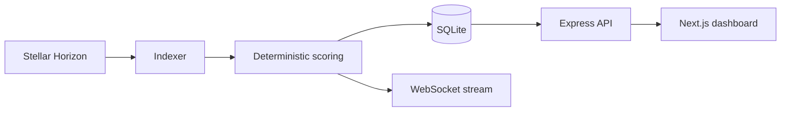

# PulseLayer

Open-source behavioral risk intelligence for the Stellar ecosystem.

[](https://stellar.org)
[](https://nextjs.org)
[](https://www.typescriptlang.org)
[](LICENSE)

PulseLayer turns public Stellar account activity into a deterministic, explainable screening signal. It combines a Horizon indexer, a TypeScript scoring engine, SQLite history, a REST/WebSocket API, and a Next.js dashboard.

The project is early-stage (`0.1.0`). It is intended for research, monitoring, and human review. A Pulse Score is not proof of identity, solvency, intent, fraud, or regulatory compliance, and must not be used as an automated adverse decision.

## Public-good case

Stellar data is public, but useful behavioral context is still fragmented across explorers, APIs, and manual investigation. PulseLayer provides a reusable starting point for wallets, analysts, builders, and ecosystem teams that need to:

- inspect account history and operational patterns
- compare accounts using the same documented heuristics
- surface unusual velocity, dormant-to-burst behavior, and failed-operation patterns
- export score evidence for a human-led review
- build integrations without depending on a proprietary risk API

The public-good value is the auditable method and reusable infrastructure, not a claim that the current heuristic is universally correct. Planned work focuses on calibration, reproducible evaluation, reliability, and community feedback.

## Current capabilities

- Reads public account and payment data from Stellar Horizon
- Calculates a bounded score from account age, activity, trustlines, XLM balance, success rate, and anomaly indicators
- Returns signal-level explanations, confidence, trend, and risk bands
- Stores accounts, transactions, counterparties, and score snapshots in SQLite
- Streams indexer events over WebSockets
- Provides searchable ranking, history, activity, and JSON export endpoints
- Includes Render, Railway, Docker, and hybrid deployment configuration
- Uses a read-only, non-custodial operating model; private keys are never required

### Data provenance

The live account lookup uses Horizon when the account is available. The development seed path combines a small set of fetched Horizon records with generated fixtures so the dashboard is usable without a large local index. Generated records are not presented as independently verified real-world labels. Production deployments should use a documented ingestion policy and retain provenance for every derived metric.

## How it works



| Area | Implementation |
|---|---|
| Ingestion | [`server/indexer.ts`](server/indexer.ts) |
| Scoring | [`server/scoring.ts`](server/scoring.ts) |
| Persistence | [`server/db.ts`](server/db.ts) |
| API and WebSocket server | [`server/server.ts`](server/server.ts) |
| Dashboard | [`src/`](src/) |
| Architecture specification | [`ARCHITECTURE.md`](ARCHITECTURE.md) |

The score starts from a neutral baseline, adds bounded positive factors, applies explicit penalties, and clamps the final result to $[0, 100]$. Every computed result includes the signals that contributed to it. See [`server/scoring.ts`](server/scoring.ts) for the executable source of truth and [`ARCHITECTURE.md`](ARCHITECTURE.md) for the current specification.

## API surface

| Method | Endpoint | Purpose |
|---|---|---|
| GET | `/api/stats` | Indexer and aggregate network metrics |
| GET | `/api/score/:account` | Account score, signals, and breakdown |
| GET | `/api/history/:account` | Score snapshots for an account |
| GET | `/api/top` | Filtered and paginated account ranking |
| GET | `/api/activity/:account` | Recent transactions and counterparties |
| GET | `/api/feed` | Recent indexed transactions |
| GET | `/api/export/:account` | Structured JSON evidence export |
| WebSocket | `/ws` | Live indexer event stream |

API responses are useful for investigation, but endpoint authentication, quotas, and production-grade abuse controls remain roadmap work. Configure `CORS_ORIGIN` for deployed environments.

## Quick start

Requirements: Node.js 20+ and npm 10+.

```bash
git clone https://github.com/Justice989810/Pulse-Layer.git
cd Pulse-Layer
npm install
npm run dev
```

Open `http://localhost:3000` for the dashboard. The API runs at `http://localhost:5001`; use `http://localhost:5001/api/stats` for a health check. `npm run dev` starts both processes, and the server initializes the local SQLite database under `data/`.

Useful commands:

```bash
npm run lint
npm run build
npm run seed
```

For deployment options and environment variables, see [`DEPLOYMENT.md`](DEPLOYMENT.md).

## Review, security, and limitations

The repository is organized so that a reviewer can trace a claim from documentation to code, data shape, and validation command. Important review boundaries are:

- public blockchain data can be incomplete, delayed, or ambiguous
- heuristics can encode false positives and false negatives
- confidence is a model output, not a statistical guarantee
- generated development fixtures must not be used as production evidence
- the system is non-custodial and does not request signing credentials
- SQL access uses prepared statements and API responses include baseline security headers

Please read [`SECURITY.md`](SECURITY.md) before reporting a vulnerability. Contributions, evaluation results, and unresolved limitations are expected to remain visible in pull requests and issues. See [`CONTRIBUTING.md`](CONTRIBUTING.md) for the review contract and [`FUTURE_PLAN.md`](FUTURE_PLAN.md) for measurable next steps.

## Funding and ecosystem readiness

| Method | Endpoint | Description |
|---|---|---|
| `GET` | `/api/stats` | Global network indexer stats, ledger height, and average trust score |
| `GET` | `/api/score/:account` | Detailed Pulse Score, factors, and active signals for Stellar address |
| `GET` | `/api/history/:account` | Historical score snapshot timeline for charts |
| `GET` | `/api/top` | Paginated directory of indexed Stellar accounts with risk filtering |
| `GET` | `/api/feed` | Recent indexed Stellar operations feed |
| `GET` | `/api/export/:account` | Download full structured JSON audit payload; invalid Stellar account IDs return `400` |

### WebSocket API
* **Endpoint**: `/ws`
* **Event Payload**:
  ```json
  {
    "type": "LIVE_TRANSACTION",
    "data": {
      "id": "tx_981249",
      "account_id": "GAK6E46MRRAG72MNDHNE54F2M43MVTK4Z2X7MHBCEEE4ZJ32FGGXX444",
      "type": "payment",
      "amount": "250.00",
      "asset": "XLM",
      "is_anomaly": false,
      "created_at": "2026-08-04T19:00:00.000Z"
    }
  }
  ```

---

## Security & Transparency

PulseLayer is designed with non-custodial and read-only operational boundaries:
* **Zero Private Key Access**: PulseLayer only reads public Stellar ledger data (`G...` public keys).
* **Input Validation**: Strict address format enforcement and SQL parameterization.
* **Read-only Horizon Ingestion**: Pure SSE stream consumption with fallback retry mechanisms.

For security policies and vulnerability reporting procedures, see **[SECURITY.md](SECURITY.md)**.

---

## Contributing and license

Bug reports, evaluation data, documentation improvements, and code contributions are welcome. Start with [`CONTRIBUTING.md`](CONTRIBUTING.md), then open a focused pull request with verification evidence.

PulseLayer is released under the [MIT License](LICENSE).
